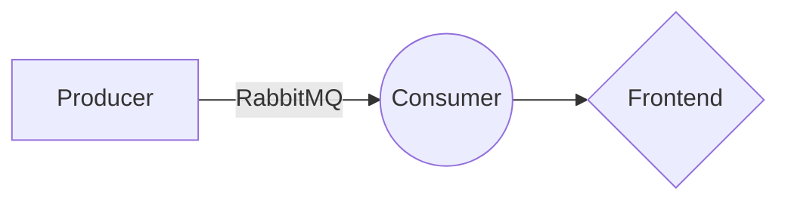

# Zegal FullStack Test
This is a coding test. I decided to use Docker for this one given the many applications involved and wanting to avoid setup issues.  

# Installation

Note that you need to wait for each service to start up before starting the next one.

 1. Clone the repo.
 2. `cd` into repo.
 3. run `docker-compose up queue`
 4. run `docker-compose up consumer`
 5. run `docker-compose up frontend`
 6. run `docker-compose up producer`
 7. Head to localhost:8080 and, *optionally*, open up the console log to see all received messages

## Services

Here's a list of services involved:

|        Service        |Description                          |Available at                         |
|----------------|-------------------------------|-----------------------------|
|Frontend|React frontend to display messages            |localhost:8080            |
|Producer          |NodeJS service that produces 20 messages per second and puts them on RabbitMQ            |localhost:3000            |
|RabbitMQ          |Queue that receives messages|localhost:15672|
|Consumer          |NodeJS service that consumes messages from RabbitMQ and sends them to Frontend service via websockets.|localhost:3001|

## Architecture

Unidirectional data flow architecture:

## TODOS

 1. Utilize functional components and hooks in the frontend
 2. Trigger producer start and stop from frontend
 3. Add tests for services